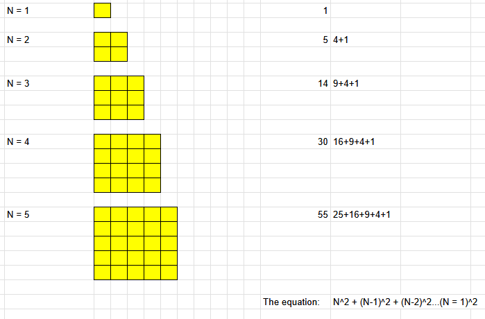
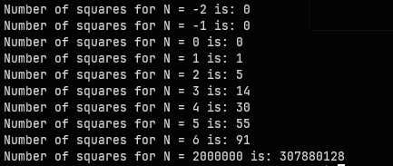

# A squares problem

This has been built on Ubuntu using the gcc (g++) compiler as shown in the build-script.
Simply make the build.sh executable
```
chmod +x build.sh
```
and then run the script 
```
./build.sh
```
to produce a bin-folder with squares.out in it.

## The visual solution
Below is how I visualized the problem and came to the solution (I actually did this on paper first, but then used google-sheets to show this here).



## My code output
The output from my code is below. Please note that I have not setup any possibility to input a number during runtime.


